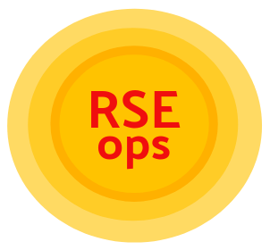

# RSE-ops



Welcome to the Research Software Engineering Operations (RSE-ops) repository! As you
might guess, RSE-ops is a flavor of DevOps.  If DevOps is the intersection of 
"Developer" and "Operations," and we want to map this idea to high performance computing,
then we can define RSE-ops as the intersection of Research Software Engineering and Operations. 
Research Software Engineers (RSEs) are the individuals writing code for scientific software, 
and supporting researchers to use codes on high performance computing systems.
RSE-ops, then, generally refers to best practices for development and operations of scientific software. 
It's important to note that HPC is only a subset of research software engineering. However,
because so many modern applications are web-based (or extend beyond HPC) it's important to 
consider that set as part of a larger scientific, or research software engineering, universe.

This project is a community initiative started at LLNL by [@vsoch](https://github.com/vsoch) and under the umbrella of
the [RADIUSS](https://software.llnl.gov/radiuss/policies/) initiatives.

## The Landscape

To learn more about RSE-ops, we invite you to visit the [landscape](https://rse-radiuss.github.io/rse-ops).

## Quick Start

Build the container, if needed.

```bash
$ make build
```

Update the landscape after making changes to the tex files in [src](src) (requires docker)

```bash
$ make
```

Run the jekyll server (requires jekyll installed)

```bash
$ make run
```

Open to [http://localhost:4000/rse-ops/](http://localhost:4000/rse-ops/)

## How does it work?

The site here renders from LaTex, which we convert to markdown. This will happen
in continuous integration, but you can also do it locally! E.g., you might first want
to make changes to LaTeX files in the [src](src) folder, and then build a container
to compile the PDF:

```bash
$ docker build -t latex2md .
```

And then enter the container, binding the present working directory with code:

```bash
$ docker run -it -v $PWD:/code --entrypoint bash latex2md
```

These commands are represented with `make build` and `make` shown earlier. The
commands above will do the following:

1. Take each file defined in [includes.txt](includes.txt) included in the [src](src) folder and render into [_includes/paper](_includes/paper)
2. Update the newly generated markdown to be in a reference format that is rendered by [jekyll-scholar](https://github.com/inukshuk/jekyll-scholar/), including a bibliography.
3. Also render a new PDF of the _entire_ document.

The cool thing is that we are rendering content into a website (Jekyll) from LaTex, and
that some content is also rendered into a traditional looking paper. Awesome! The first
is more fun and readable, and the second is mostly expected for any kind of academic
endeavour.

### 1. Build the Paper PDF

You'll have pandoc on the path:

```bash
# which pandoc
/usr/bin/pandoc
```

And you can use it to compile the entire paper into a PDF:

```bash
$ cd /code/src
$ pandoc -s main.tex -o "rse-ops.pdf" --pdf-engine=xelatex  --bibliography rseops.bib --citeproc
```

Note that the output format isn't perfect - I'm still working on figuring out how
to get from Overleaf to manual here!

### 2. Build Pages

For each page, the basic logic to convert from latex to markdown is:

```bash
$ pandoc -s monitoring.tex -o monitoring.md
```

This is the basic logic that we use to render pages of content for the Jekyll site,
and we render them to be "includes" to make it easy to insert snippets where we need them!

### 3. Automate Build for Site

Thus, we can combine the two things above to automatically build the site - meaning
that we render latex based on a list in [includes.txt](includes.txt) to generate
markdown that is then included in the pages. After building the container, do
the following:

```bash
$ docker run -it -v $PWD:/code latex2md
```

## Thank you

Thank you to contributors to the original Overleaf document that are not included
in the version history, including:

 - [tgamblin](https://github.com/tgamblin)
 - [reidpr](https://github.com/reidpr)

This is a community effort across national labs, academic institutions, and interested
parties in industry, and we encourage you to participate! 

License
-------

Copyright (c) 2017-2021, Lawrence Livermore National Security, LLC
and contributors.

This project is licensed under the MIT license [LICENSE](./LICENSE).

Copyrights and patents in the RSE-ops project are retained by
contributors. No copyright assignment is required to contribute to this
project.

This work was produced under the auspices of the U.S. Department of
Energy by Lawrence Livermore National Laboratory under Contract
DE-AC52-07NA27344.

LLNL-TR-824197
